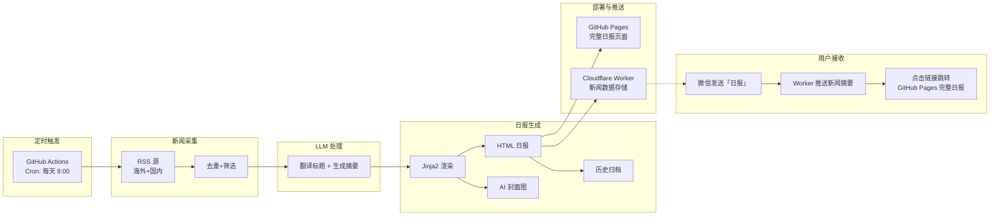
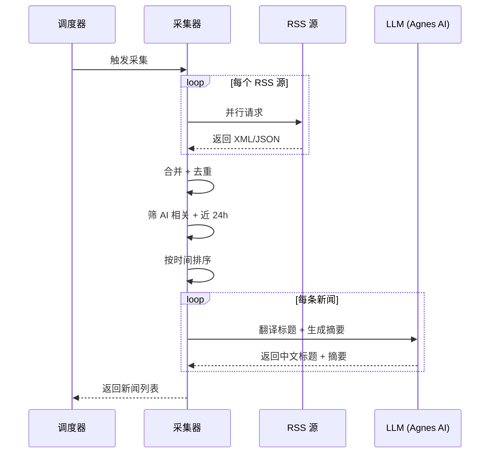
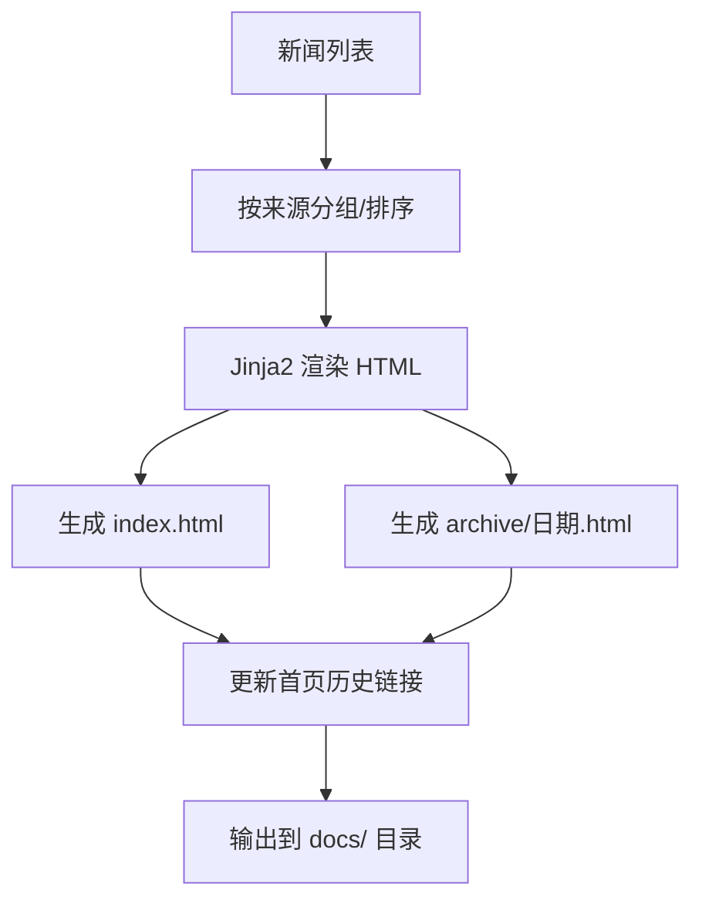
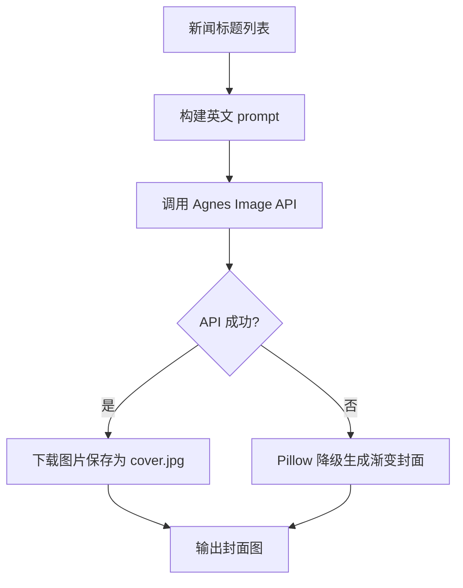
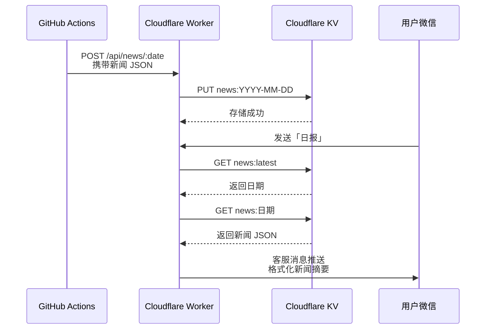
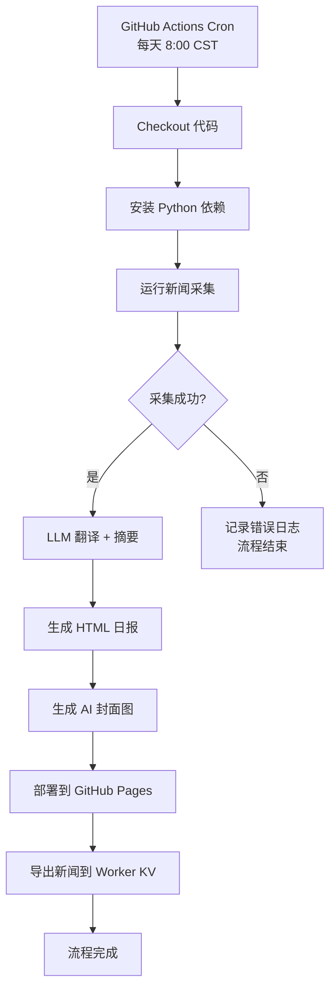

# PRD: AI 每日新闻推送 Agent

> **文档版本**: 1.2
> **状态**: 草稿
> **作者**: -
> **创建日期**: 2025-06-25
> **最后更新**: 2026-07-02

## 1. 文档信息

### 1.1 基本信息

| 属性 | 值 |
|------|-----|
| PRD 编号 | PRD-AINEWS-001 |
| 所属产品 | AI Daily News Agent |
| 优先级 | P0 |
| 预计版本 | v1.2 |
| PRD 基线版本 | v1.0 |
| 最后同步日期 | 2026-07-02 |

### 1.2 修订历史

| 版本 | 日期 | 变更内容 | 作者 |
|------|------|----------|------|
| 1.0 | 2025-06-25 | 初稿 | - |
| 1.1 | 2026-06-26 | 更新微信推送方案：测试号模板消息 → 公众号群发图文消息；LLM 摘要改为 v1.0 启用；新增 GitHub Pages + 微信文章双通道方案 | - |
| 1.2 | 2026-07-02 | LLM 从 OpenAI 切换为 Agnes AI；新增 AI 封面图生成（Agnes Image 2.1 Flash）；LLM 同时翻译英文标题为中文 + 生成摘要；新增中文 AI 新闻源（36氪、机器之心）；微信推送改为个人推送（客服消息 API）；部署改为 peaceiris/actions-gh-pages | - |

### 1.3 术语表

| 术语 | 定义 |
|------|------|
| RSS | Really Simple Syndication，网站内容订阅标准格式 |
| GitHub Pages | GitHub 提供的静态网页托管服务 |
| 微信公众号（订阅号） | 微信官方提供的内容分发平台 |
| 群发图文消息 | 公众号向关注者推送的结构化内容（需企业认证） |
| 客服消息 | 用户 48 小时内互动后可向其推送的消息（个人订阅号可用） |
| Cloudflare Workers | Cloudflare 提供的边缘计算服务，运行无服务器函数 |
| Cloudflare KV | Cloudflare 提供的键值对存储服务，免费额度充裕 |
| 阅读全文 | 微信图文消息底部的跳转按钮，可链接到外部网页 |

---

## 2. 背景与目标

### 2.1 业务背景

AI 领域新闻更新速度快、信息源分散（海外有 TechCrunch、The Verge、Hacker News 等，国内有机器之心、量子位等），用户每天需要打开多个网站/app 才能跟上行业动态。

### 2.2 产品目标

打造一个**全自动、零成本、零运维**的 AI 新闻日报推送系统，面向公众提供：

1. 每日自动采集 AI 圈重要新闻，覆盖中英文主流媒体
2. 生成美观的日报网页，每条新闻可点击跳转原文，支持历史回溯
3. 通过 Cloudflare Worker 实现微信个人推送，用户发送关键词即可获取日报
4. 用户点击链接跳转 GitHub Pages 查看完整日报
5. 无需服务器，无需付费，一次配置长期运行

### 2.3 成功指标

| 指标 | 目标值 | 数据来源 | 度量方式 |
|------|--------|----------|----------|
| 新闻覆盖率 | 每天 ≥ 10 条 AI 新闻 | 日报页面 | 人工抽查 |
| 采集成功率 | ≥ 95%（月均） | GitHub Actions 日志 | 统计采集步骤失败次数 |
| 页面可用性 | ≥ 99% | GitHub Pages 状态 | 通过 URL 访问检查 |
| 端到端执行时间 | ≤ 5 分钟 | GitHub Actions 耗时 | 查看 workflow 运行时间 |
| 用户满意度 | 每周至少查看 3 次 | 用户反馈 | 定性评估 |

---

## 3. 范围

### 3.1 范围内

- 多源 RSS 新闻自动采集（海外 + 国内 AI 媒体）
- 新闻去重、筛选、排序
- LLM 翻译英文标题为中文 + 生成中文摘要（Agnes AI）
- HTML 日报页面生成（手机端适配）
- AI 封面图生成（Agnes Image 2.1 Flash）
- GitHub Pages 自动部署
- 微信个人推送（客服消息 API，用户主动获取）
- 日报历史归档和浏览
- GitHub Actions 每日定时调度
- 配置化的 RSS 源管理

### 3.2 范围外

- 新闻内容的深度分析和评论
- 用户个性化偏好定制（v1.0 所有人看到相同日报）
- 用户订阅管理（面向所有关注者）
- 新闻推送的即时性（非实时，每日一次批量推送）
- 视频/音频类新闻内容

---

## 4. 系统概述

### 4.1 功能概述

AI Daily News Agent 是一个全自动的日报生成与推送系统。每天定时从多个 AI 媒体 RSS 源抓取新闻，LLM 翻译英文标题为中文并生成摘要，渲染为手机端适配的 HTML 日报页面部署到 GitHub Pages，同时通过 Cloudflare Worker 实现微信个人推送。用户在微信里发送关键词「日报」即可收到当天新闻摘要。

### 4.2 调用方

| 调用方 | 调用场景 |
|--------|----------|
| GitHub Actions 定时调度器 | 每天 8:00 触发主流程 |
| 用户手动触发 | 用户可在 GitHub Actions 页面手动执行 workflow |
| 用户（微信端） | 发送关键词获取日报 |
| 外部访客 | 通过 GitHub Pages URL 直接访问日报页面 |

### 4.3 能力概览



---

## 5. 功能需求

### 5.1 新闻采集模块

#### 5.1.1 功能描述

从多个 RSS 源并行抓取 AI 相关新闻，合并去重，筛选近 24 小时的内容，输出结构化新闻列表。

#### 5.1.2 处理流程



#### 5.1.3 业务规则

| 规则编号 | 规则描述 | 触发条件 |
|----------|----------|----------|
| BR-001 | 同 URL 的新闻视为重复，仅保留一条 | 合并时 |
| BR-002 | 同标题（相似度 > 90%）视为重复，仅保留一条 | 合并时 |
| BR-003 | 发布时间超过 24 小时的新闻不收录 | 筛选时 |
| BR-004 | 新闻标题或摘要中不含 AI/ML/LLM/NLP/CV 等关键词的，不收录 | 筛选时 |
| BR-005 | 单个 RSS 源请求超时 30 秒，跳过该源继续 | 采集时 |
| BR-006 | 采集失败（所有源都失败），标记为失败并记录日志，不推送 | 流程结束时 |
| BR-007 | LLM 调用超时 30 秒，跳过该新闻的摘要生成，不影响整体流程 | 摘要时 |

#### 5.1.4 输入输出

**输入**：
- RSS 源 URL 列表（配置文件维护，可增减）
- 默认 RSS 源：

| 源名称 | 地区 | URL |
|--------|------|-----|
| Hacker News AI | 海外 | https://hnrss.org/frontpage?q=AI+OR+LLM+OR+GPT+OR+Claude |
| TechCrunch AI | 海外 | https://techcrunch.com/category/artificial-intelligence/feed/ |
| The Verge AI | 海外 | https://www.theverge.com/rss/ai-artificial-intelligence/index.xml |
| Ars Technica AI | 海外 | https://feeds.arstechnica.com/arstechnica/technology-lab |
| 36氪 AI | 国内 | https://36kr.com/feed |
| 机器之心 | 国内 | https://www.jiqizhixin.com/rss |

**输出**：
- 结构化新闻列表，每条包含：标题、chinese_title（中文翻译）、summary（中文摘要）、原文链接、来源名称、发布时间

**副作用**：
- 无

---

### 5.2 HTML 日报生成模块

#### 5.2.1 功能描述

将新闻列表渲染为美观的静态 HTML 页面，适配手机端浏览，同时生成历史归档页面。

#### 5.2.2 处理流程



#### 5.2.3 业务规则

| 规则编号 | 规则描述 | 触发条件 |
|----------|----------|----------|
| BR-008 | 首页固定为 `docs/index.html`，每次运行覆盖 | 生成时 |
| BR-009 | 历史页面命名格式：`docs/archive/YYYY-MM-DD.html` | 生成时 |
| BR-010 | 首页底部展示近 7 天历史链接 | 生成时 |
| BR-011 | 页面必须适配 320px-768px 宽度的移动端屏幕 | 渲染时 |
| BR-012 | 新闻标题显示中文翻译（chinese_title），无翻译则显示原文 | 渲染时 |

#### 5.2.4 输入输出

**输入**：
- 结构化新闻列表（标题、中文翻译标题、链接、来源、时间、摘要）

**输出**：
- `docs/index.html` — 当天日报首页
- `docs/archive/YYYY-MM-DD.html` — 历史归档页

**副作用**：
- 无

---

### 5.3 AI 封面图生成模块

#### 5.3.1 功能描述

使用 Agnes Image 2.1 Flash 根据当日新闻标题自动生成封面图，用于微信推送和日报展示。

#### 5.3.2 处理流程



#### 5.3.3 业务规则

| 规则编号 | 规则描述 | 触发条件 |
|----------|----------|----------|
| BR-013 | 封面图尺寸为 900×500px | 生成时 |
| BR-014 | API 失败时降级为 Pillow 生成渐变背景封面 | 降级时 |
| BR-015 | 封面图每天自动变化，不重复 | 每次运行 |

#### 5.3.4 输入输出

**输入**：
- 新闻列表（取前 5 条标题构建 prompt）
- Agnes API Key

**输出**：
- `docs/cover.jpg` — 封面图片文件

---

### 5.4 微信个人推送模块

#### 5.4.1 功能描述

通过 Cloudflare Worker 接收微信用户消息，用户发送关键词「日报」后，通过微信客服消息 API 推送当天新闻摘要。

**注意**：个人订阅号不支持群发接口，改用客服消息 API 实现用户主动获取。

#### 5.4.2 处理流程



#### 5.4.3 业务规则

| 规则编号 | 规则描述 | 触发条件 |
|----------|----------|----------|
| BR-016 | 用户需发送关键词「日报」触发推送 | 用户交互 |
| BR-017 | 客服消息仅限 48 小时内互动过的用户 | 微信 API 限制 |
| BR-018 | 推送内容为当天 Top 10 条新闻（标题+来源+摘要） | 推送时 |
| BR-019 | 推送消息末尾附 GitHub Pages 完整日报链接 | 推送时 |
| BR-020 | KV 存储 TTL 90 天，自动清理过期数据 | 存储时 |

#### 5.4.4 输入输出

**输入**：
- 用户发送的关键词消息
- Cloudflare KV 中存储的新闻数据

**输出**：
- 微信客服消息（文本格式）

**副作用**：
- 用户收到当天新闻摘要

#### 5.4.5 推送消息格式示例

```
🤖 AI 日报 2026-07-02
📋 今日 15 条 AI 新闻

1. Liva AI (YC S25) 正在招聘
   来源: Hacker News AI
   YC 孵化的 AI 公司 Liva 宣布启动招聘...

2. Besimple AI (YC P25) 正在招聘
   来源: Hacker News AI
   ...

🔗 完整日报: https://tanx0702.github.io/ai-daily-news/
💡 回复「帮助」查看指令说明
```

---

### 5.5 定时调度模块

#### 5.5.1 功能描述

通过 GitHub Actions 的 cron 功能，每天定时触发完整流程：采集 → 翻译+摘要 → 生成 → 部署 → 推送。

#### 5.5.2 处理流程



#### 5.5.3 业务规则

| 规则编号 | 规则描述 | 触发条件 |
|----------|----------|----------|
| BR-021 | 默认执行时间为北京时间每天 8:00（UTC 0:00） | 定时触发 |
| BR-022 | 支持通过 workflow_dispatch 手动触发 | 手动操作 |
| BR-023 | 敏感信息（API Key 等）通过 GitHub Secrets 管理 | 运行时 |
| BR-024 | LLM 调用超时 30 秒，跳过该新闻的摘要生成 | 摘要时 |
| BR-025 | 部署使用 peaceiris/actions-gh-pages 自动推送到 gh-pages 分支 | 部署时 |

---

## 6. 接口能力

### 6.1 新闻采集能力

| 属性 | 说明 |
|------|------|
| 能力描述 | 从多个 RSS 源批量抓取并筛选 AI 新闻 |
| 调用方 | 定时调度器 |
| 认证要求 | 不需要（公开 RSS） |

#### 输入要求
- RSS 源 URL 列表
- 时间范围（默认近 24 小时）

#### 输出要求
- 成功时：结构化新闻列表（标题、中文翻译标题、链接、来源、时间、摘要）
- 失败时：错误信息

#### 业务约束
- 单源 30 秒超时
- 最终输出 15 条（可配置）

### 6.2 日报生成能力

| 属性 | 说明 |
|------|------|
| 能力描述 | 将新闻列表渲染为 HTML 日报页面 + AI 封面图 |
| 调用方 | 定时调度器 |
| 认证要求 | 不需要 |

#### 输入要求
- 新闻列表（标题、中文翻译标题、链接、来源、时间、摘要）
- 日期

#### 输出要求
- 成功时：HTML 文件写入 docs/ 目录 + cover.jpg
- 失败时：错误信息

#### 业务约束
- 必须生成移动端适配的页面
- 必须同时更新首页和历史归档

### 6.3 微信个人推送能力

| 属性 | 说明 |
|------|------|
| 能力描述 | 通过 Cloudflare Worker 接收微信消息，推送客服消息 |
| 调用方 | 用户（微信端） |
| 认证要求 | 需要 appID + appSecret（存储在 Worker 环境变量中） |

#### 输入要求
- 用户发送的关键词消息（如「日报」）

#### 输出要求
- 成功时：微信客服消息推送
- 失败时：错误提示

#### 业务约束
- 仅限 48 小时内互动过的用户
- 推送内容为当天 Top 10 条新闻摘要

### 6.4 Cloudflare Worker 能力

| 属性 | 说明 |
|------|------|
| 能力描述 | 接收 GitHub Actions 推送的新闻 JSON，存储到 KV；接收微信回调，推送客服消息 |
| 调用方 | GitHub Actions（新闻存储）、微信（消息回调） |
| 认证要求 | 不需要（GitHub Actions 通过 URL 调用；微信通过签名验证） |

---

## 7. 数据概念

### 7.1 业务实体

| 实体 | 说明 | 关键属性 |
|------|------|----------|
| 新闻条目 | 从 RSS 源采集的单条新闻 | 标题、中文翻译标题、原文链接、来源名称、发布时间、摘要 |
| 日报 | 某一天的新闻集合 | 日期、新闻列表、生成时间 |
| 源配置 | 一个 RSS 源的配置信息 | 名称、URL、所属地区、是否启用 |
| 推送记录 | 一次微信推送的操作记录 | 推送时间、日报日期、新闻条数、推送结果 |

### 7.2 实体关系

```mermaid
erDiagram
    源配置 ||--o{ 新闻条目 : 产生
    新闻条目 ||--o{ 日报 : 组成
    日报 ||--o{ Cloudflare KV : 存储
    Cloudflare KV --o{ 微信推送 : 触发
```

---

## 8. 非功能需求

### 8.1 性能要求

| 场景 | 指标 | 要求 |
|------|------|------|
| RSS 采集 | 完成时间 | ≤ 60 秒 |
| LLM 翻译+摘要 | 完成时间 | ≤ 60 秒（15 条 × 4 秒/条） |
| HTML 生成 | 完成时间 | ≤ 5 秒 |
| AI 封面图生成 | 完成时间 | ≤ 30 秒 |
| 微信推送 | 响应时间 | ≤ 5 秒 |
| 端到端流程 | 总耗时 | ≤ 5 分钟 |
| 日报页面 | 首屏加载 | ≤ 2 秒 |

### 8.2 可靠性要求

| 要求 | 目标 |
|------|------|
| 采集成功率 | ≥ 95%（部分源失败不影响整体） |
| 系统可用性 | 依赖 GitHub + Cloudflare 基础设施 |

### 8.3 安全要求

| 要求 | 说明 |
|------|------|
| 凭证保护 | API Key 等敏感信息通过 GitHub Secrets / Worker 环境变量存储 |
| 公开内容 | 日报页面为公开静态网页，不包含任何用户私密信息 |
| 最小权限 | GitHub Actions 仅需读写仓库内容权限 |

### 8.4 兼容性要求

| 要求 | 说明 |
|------|------|
| 浏览器兼容 | 日报页面兼容 iOS Safari、Android Chrome、微信内置浏览器 |
| 接口兼容 | 微信公众号 API 变更时需适配 |

---

## 9. 依赖与约束

### 9.1 已知约束

- **RSS 源可用性**：第三方 RSS 源可能变更、失效或被墙，需定期维护源列表
- **微信公众号客服消息**：仅限 48 小时内互动过的用户
- **GitHub Pages 免费限制**：公开仓库，日报内容公开可见
- **运行环境**：GitHub Actions 的 Linux 环境（Ubuntu runner）
- **Cloudflare Workers**：免费版有 10 万次请求/天限制

### 9.2 外部依赖

| 依赖 | 用途 | 影响 |
|------|------|------|
| 各媒体 RSS 源 | 新闻数据来源 | 源失效则新闻减少 |
| Agnes AI API | 标题翻译 + 摘要生成 + 封面图 | API 不可用则跳过摘要/使用降级 |
| 微信公众号 API | 微信推送 | API 不可用则推送失败 |
| GitHub Actions | 定时调度 | 平台故障则当天不会执行 |
| GitHub Pages | 日报托管 | 不可用则页面无法访问 |
| Cloudflare Workers + KV | 新闻数据存储 + 微信回调 | 不可用则微信推送失败 |

---

## 10. 项目计划

### 10.1 里程碑

| 里程碑 | 目标日期 | 交付物 |
|--------|----------|--------|
| M1: 项目骨架 + 新闻采集 | 第 1 天 | 可跑通的采集脚本，输出 JSON |
| M2: HTML 生成 + Pages 部署 | 第 2 天 | 可访问的日报页面 |
| M3: LLM 摘要 + 微信推送 | 第 3 天 | 端到端跑通 |
| M4: AI 封面图 + 中文翻译 | 第 4 天 | 封面图 + 中文标题 |
| M5: 微信个人推送 | 第 5 天 | Worker + 客服消息推送 |
| M6: 上线试运行 | 第 6 天 | 配置完成，首次自动推送 |

---

## 11. 风险与缓解

| 风险 | 影响 | 概率 | 缓解措施 |
|------|------|------|----------|
| RSS 源失效或内容质量下降 | 中：新闻减少或不相关 | 中 | RSS 源列表可配置，支持随时增减；多源冗余 |
| 微信公众号 API 策略变更 | 高：推送完全失败 | 低 | 可切换为 PushPlus / 企业微信等备选方案 |
| Cloudflare Workers 免费额度调整 | 低：个人用量远低于上限 | 低 | 可迁移到其他 Serverless 平台 |
| Agnes AI API 变更或停机 | 中：摘要/封面图失败 | 低 | 降级策略：保留原标题 + Pillow 封面 |
| 每日新闻过少（节假日/周末） | 低：日报内容偏少 | 中 | 无大碍，正常反映实际情况 |

---

## 12. 验收标准

### AC-001: 新闻采集正确性
- [ ] 能从至少 5 个 RSS 源成功抓取新闻
- [ ] 按发布时间去重（同标题/同链接不重复出现）
- [ ] 仅展示近 24 小时新闻
- [ ] 能过滤掉明显不相关的新闻
- [ ] 单个源失败不影响其他源的采集

### AC-002: 日报页面可用性
- [ ] 页面在手机浏览器中正常显示，内容不溢出
- [ ] 每条新闻标题为可点击链接（中文翻译），跳转到原文
- [ ] 页面底部有历史归档链接
- [ ] 页面加载时间 < 2 秒

### AC-003: 微信个人推送
- [ ] 用户发送「日报」后能收到当天新闻摘要
- [ ] 推送内容包含 Top 10 条新闻（中文标题+来源+摘要）
- [ ] 推送消息末尾附有 GitHub Pages 完整日报链接
- [ ] 推送失败时有错误日志

### AC-004: 定时自动执行
- [ ] 每天 8:00（北京时间）自动触发
- [ ] 支持手动触发
- [ ] 执行日志完整可追溯

### AC-005: AI 封面图
- [ ] 每天自动生成不同的封面图
- [ ] 封面图尺寸 900×500px
- [ ] API 失败时降级为 Pillow 生成

### AC-006: 历史归档
- [ ] 历史日报可通过归档链接访问
- [ ] 首页展示近 7 天历史
- [ ] 旧日报不会被覆盖

---

## 13. 待澄清问题

| 编号 | 问题 | 提出人 | 状态 | 结论 |
|------|------|--------|------|------|
| Q1 | LLM 摘要是否在 v1.0 启用？ | - | 已确认 | v1.0 启用 LLM 摘要 |
| Q2 | 默认 RSS 源列表是否确认？ | - | 已确认 | 见 5.1.4 节 |
| Q3 | 推送时间是否确定为每早 8:00？ | - | 已确认 | 默认 8:00 CST |
| Q4 | 微信公众号是否已注册？ | - | 已确认 | 个人订阅号（不支持群发，使用客服消息） |
| Q5 | 推送方式是模板消息还是群发图文？ | - | 已确认 | 群发图文消息（企业号）→ 客服消息（个人号） |
| Q6 | 是否需要中文翻译？ | - | 已确认 | LLM 同时翻译英文标题为中文 |
| Q7 | 封面图是否自动生成？ | - | 已确认 | Agnes Image API 生成，失败时降级 |

---

## 附录

### A. 用户配置步骤（一次性）

#### A.1 微信公众号注册

1. 打开 https://mp.weixin.qq.com ，选择"订阅号"注册
2. 填写个人信息（个人订阅号功能受限，不支持群发）
3. 在"开发 → 基本配置"中获取 AppID 和 AppSecret

#### A.2 GitHub 配置

4. 创建 GitHub 公开仓库
5. Settings → Pages → Source 选 `gh-pages` 分支的 `/ (root)` 文件夹
6. 在 Settings → Secrets 中配置：
   - `AGNES_API_KEY` — Agnes AI API Key
   - `WECHAT_APP_ID` — 公众号 AppID
   - `WECHAT_APP_SECRET` — 公众号 AppSecret
   - `NEWS_WORKER_URL` — Cloudflare Worker 地址
7. 推送代码，等待首次执行

#### A.3 Cloudflare Worker 配置

8. 注册 Cloudflare 账号
9. 购买域名（推荐 `.xyz`，Cloudflare Registrar 首年约 1 元）
10. 创建 Worker，绑定 KV 命名空间
11. 部署 `workers/weixin-worker.js`
12. 在公众号后台配置服务器地址：`https://<worker>.<domain>.workers.dev/callback`

### B. 备选推送方案

| 方案 | 迁移成本 | 说明 |
|------|---------|------|
| PushPlus | 低 | 改一个推送函数即可，支持 Markdown |
| 企业微信机器人 | 低 | 需注册企业微信，webhook 推送 |
| Telegram Bot | 低 | 需用户加入频道，适合海外用户 |
