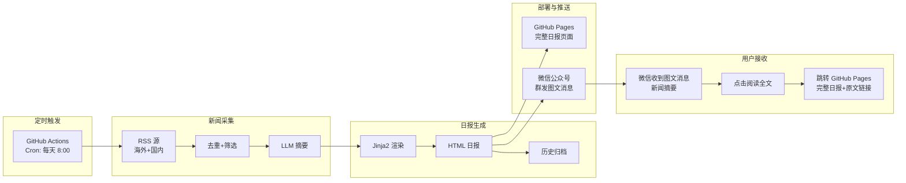
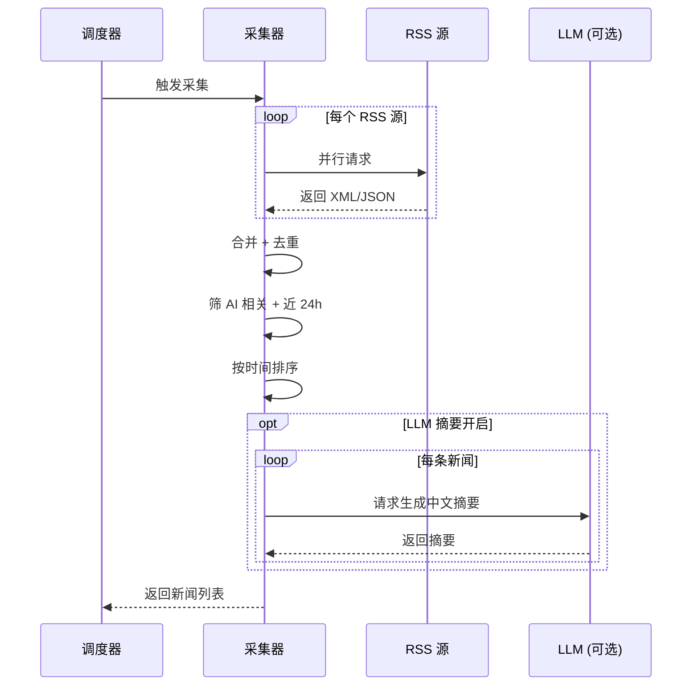
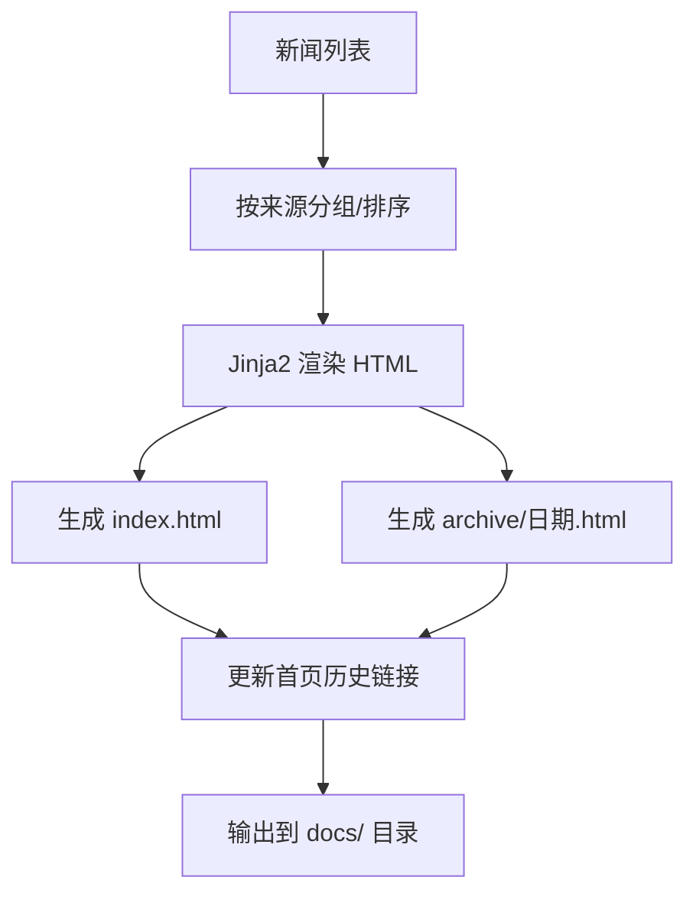
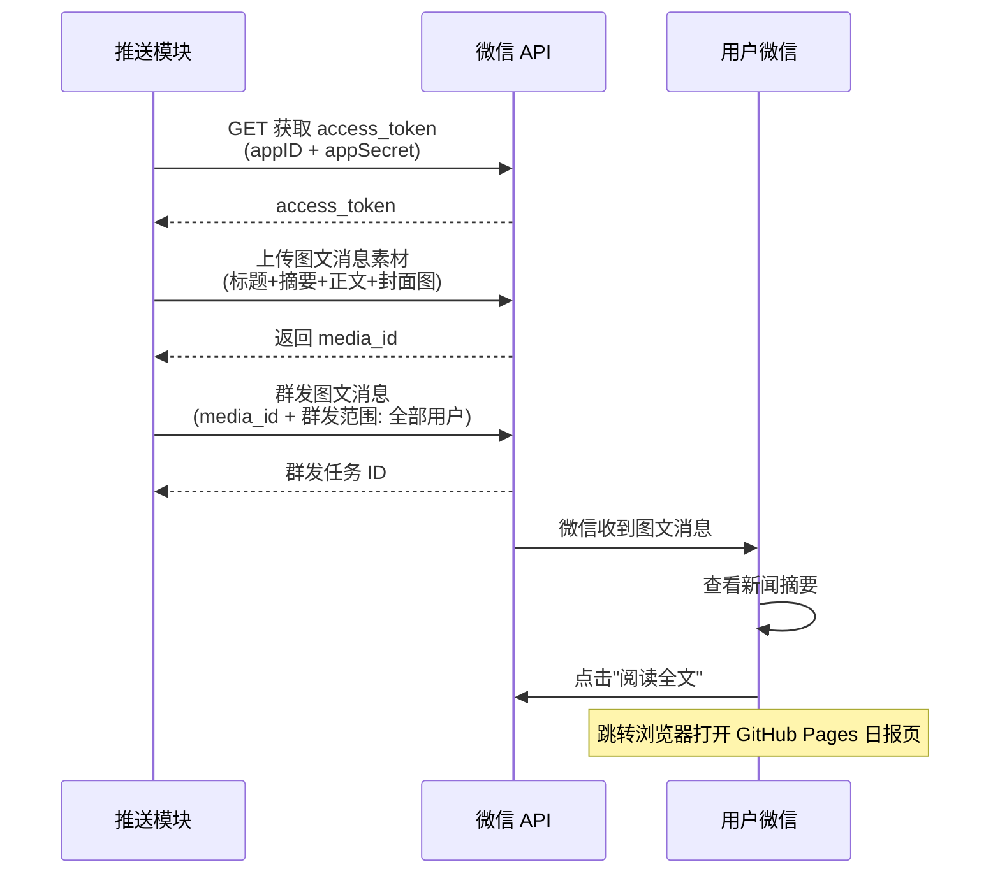
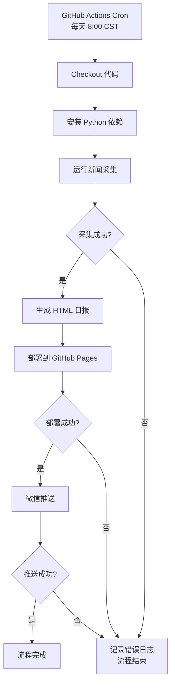
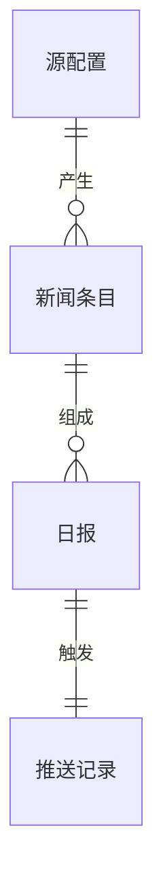

# PRD: AI 每日新闻推送 Agent

> **文档版本**: 1.1
> **状态**: 草稿
> **作者**: -
> **创建日期**: 2025-06-25
> **最后更新**: 2026-06-26

<!-- TRACEABILITY-METADATA:BEGIN -->
```yaml
schema:
  name: testany-traceability
  version: "1.0.0"
  profile: prd-profile-v1
artifact:
  id: PRD-AINEWS-001
  type: PRD
  title: AI 每日新闻推送 Agent
  status: draft
  owners: []
  created_at: 2025-06-25
  updated_at: 2026-06-26
  source_documents: []
entities:
  requirements:
    - id: REQ-NEWS-001
      class: FUNCTIONAL
      title: 多源 RSS 新闻采集
      statement: 系统每日定时从多个 AI 媒体 RSS 源抓取新闻，合并去重，筛选近24小时内容
      priority: P0
      status: draft
      scope: 新闻采集模块
      acceptance_criteria:
        - 至少覆盖 5 个 RSS 源（海外+国内）
        - 按发布时间去重（同标题/同链接视为重复）
        - 仅保留近 24 小时内的新闻
        - 采集失败时有重试机制（最多3次）
    - id: REQ-NEWS-002
      class: FUNCTIONAL
      title: 新闻筛选与排序
      statement: 对采集的新闻进行 AI 相关性筛选，按重要性排序，输出 Top 15-20 条
      priority: P0
      status: draft
      scope: 新闻采集模块
      acceptance_criteria:
        - 能过滤掉非 AI 领域新闻
        - 输出数量可配置（默认 15-20 条）
        - 按发布时间倒序排列
    - id: REQ-NEWS-003
      class: FUNCTIONAL
      title: LLM 摘要增强
      statement: 启用 LLM 为每条新闻生成中文摘要，丰富日报内容
      priority: P0
      status: draft
      scope: LLM 摘要模块
      acceptance_criteria:
        - 摘要长度不超过 150 字
        - 摘要语言为中文
        - LLM 调用超时有降级策略（跳过摘要，保留原文标题）
    - id: REQ-NEWS-004
      class: FUNCTIONAL
      title: HTML 日报页面生成
      statement: 将采集的新闻列表渲染为美观的 HTML 日报页面，支持手机端浏览
      priority: P0
      status: draft
      scope: 页面生成模块
      acceptance_criteria:
        - 页面包含：日期标题、新闻列表（标题可点击+来源+摘要）、历史归档入口
        - 移动端自适应（微信内置浏览器正常显示）
        - 页面加载时间 < 2 秒
        - 每条新闻标题为可点击的外部链接
    - id: REQ-NEWS-005
      class: FUNCTIONAL
      title: 日报历史归档
      statement: 每次生成的日报自动归档，提供历史浏览入口
      priority: P1
      status: draft
      scope: 页面生成模块
      acceptance_criteria:
        - 历史日报按日期路径存储（如 /archive/2025-06-25.html）
        - 首页底部展示近 7 天历史链接
        - 旧日报页面保持可访问
    - id: REQ-NEWS-006
      class: FUNCTIONAL
      title: GitHub Pages 自动部署
      statement: 生成的 HTML 页面自动部署到 GitHub Pages，获得公开可访问 URL
      priority: P0
      status: draft
      scope: 部署模块
      acceptance_criteria:
        - 部署成功后页面可通过 https://<user>.github.io/<repo>/ 访问
        - 部署在 2 分钟内完成
        - 部署失败时有日志记录
    - id: REQ-NEWS-007
      class: FUNCTIONAL
      title: 微信公众号群发图文消息
      statement: 通过微信公众号群发接口，每日向所有关注者推送一篇图文消息，内容包含新闻摘要和跳转链接
      priority: P0
      status: draft
      scope: 微信推送模块
      acceptance_criteria:
        - 每日群发 1 篇图文消息
        - 图文消息标题为 AI 日报日期
        - 图文消息正文包含当日精选新闻摘要（Top 5-10 条）
        - 图文消息底部有"阅读全文"按钮，跳转至 GitHub Pages 日报页面
        - 推送失败时有重试和错误日志
    - id: REQ-NEWS-008
      class: FUNCTIONAL
      title: GitHub Actions 定时调度
      statement: 使用 GitHub Actions 每天定时触发整个流程（采集→生成→部署→推送）
      priority: P0
      status: draft
      scope: 调度模块
      acceptance_criteria:
        - 默认每天早 8:00（北京时间）自动执行
        - 执行时间可配置
        - 支持手动触发
        - 执行失败时 GitHub Actions 日志可见
  risks:
    - id: RSK-001
      description: RSS 源可能变更或失效，导致新闻采集不全
      impact: 中
      probability: 中
      mitigation: 支持手动添加/替换 RSS 源，不依赖单一源
    - id: RSK-002
      description: 微信公众号群发接口每天限 1 次，错过无法补发
      impact: 中
      probability: 低
      mitigation: 每天 8:00 执行，预留充足时间；失败时记录日志
    - id: RSK-003
      description: GitHub Actions 执行时间超过免费额度
      impact: 低
      probability: 低
      mitigation: 单次执行预计 2-3 分钟，每月 2000 分钟额度绰绰有余
    - id: RSK-004
      description: 公众号文章内容审核不通过，图文消息被拒
      impact: 中
      probability: 低
      mitigation: 推送内容仅含新闻标题和摘要，不含敏感信息；准备备选推送方案
    - id: RSK-005
      description: 公众号资质要求企业/个体户注册
      impact: 高
      probability: 中
      mitigation: 提前注册订阅号；注册完成前可先用 GitHub Pages 公开链接分享
  flows:
    - id: FLOW-001
      title: 每日主流程
      steps:
        - GitHub Actions 定时触发 (08:00)
        - 多源 RSS 并行抓取
        - 合并去重 + AI 筛选
        - LLM 摘要生成
        - Jinja2 渲染 HTML 日报
        - 部署到 GitHub Pages
        - 微信群发图文消息（摘要+阅读全文跳转 GitHub Pages）
relations: []
waivers: []
```
<!-- TRACEABILITY-METADATA:END -->

---

## 1. 文档信息

### 1.1 基本信息

| 属性 | 值 |
|------|-----|
| PRD 编号 | PRD-AINEWS-001 |
| 所属产品 | AI Daily News Agent |
| 优先级 | P0 |
| 预计版本 | v1.0 |
| PRD 基线版本 | v1.0 |
| 最后同步日期 | 2025-06-25 |

### 1.2 修订历史

| 版本 | 日期 | 变更内容 | 作者 |
|------|------|----------|------|
| 1.0 | 2025-06-25 | 初稿 | - |
| 1.1 | 2026-06-26 | 更新微信推送方案：测试号模板消息 → 公众号群发图文消息；LLM 摘要改为 v1.0 启用；新增 GitHub Pages + 微信文章双通道方案 | - |

### 1.3 术语表

| 术语 | 定义 |
|------|------|
| RSS | Really Simple Syndication，网站内容订阅标准格式 |
| GitHub Pages | GitHub 提供的静态网页托管服务 |
| 微信公众号（订阅号） | 微信官方提供的内容分发平台，支持每日群发图文消息 |
| 群发图文消息 | 公众号向关注者推送的结构化内容，包含标题、封面、正文和跳转链接 |
| 阅读全文 | 微信图文消息底部的跳转按钮，可链接到外部网页 |

---

## 2. 背景与目标

### 2.1 业务背景

AI 领域新闻更新速度快、信息源分散（海外有 TechCrunch、The Verge、Hacker News 等，国内有机器之心、量子位等），用户每天需要打开多个网站/app 才能跟上行业动态。存在以下痛点：

- **信息分散**：需要逐一访问多个信息源，效率低
- **遗漏风险**：人工浏览容易错过重要新闻
- **缺乏摘要**：标题信息量有限，点进去才知道是否值得读
- **推送渠道不便**：现有资讯 app 推送体验参差不齐，用户希望在自己最常用的微信里接收

### 2.2 产品目标

打造一个**全自动、零成本、零运维**的 AI 新闻日报推送系统，面向公众提供：

1. 每日自动采集 AI 圈重要新闻，覆盖中英文主流媒体
2. 生成美观的日报网页，每条新闻可点击跳转原文，支持历史回溯
3. 通过微信公众号每日群发图文消息，用户微信里即可看到新闻摘要
4. 用户点击"阅读全文"跳转 GitHub Pages 查看完整日报
5. 无需服务器，无需付费，一次配置长期运行

### 2.3 成功指标

| 指标 | 目标值 | 数据来源 | 度量方式 |
|------|--------|----------|----------|
| 新闻覆盖率 | 每天 ≥ 10 条 AI 新闻 | 日报页面 | 人工抽查 |
| 采集成功率 | ≥ 95%（月均） | GitHub Actions 日志 | 统计采集步骤失败次数 |
| 推送到达率 | 100%（正常工作日） | 公众号后台消息统计 | 群发结果 |
| 页面可用性 | ≥ 99% | GitHub Pages 状态 | 通过 URL 访问检查 |
| 端到端执行时间 | ≤ 3 分钟 | GitHub Actions 耗时 | 查看 workflow 运行时间 |
| 用户满意度 | 每周至少查看 3 次 | 用户反馈 | 定性评估 |

### 2.4 业务现状

#### 当前流程

本功能为全新建设，用户在 AI 新闻获取上依赖手动浏览多个网站。

#### 业务变更

| 变更项 | 变更前 | 变更后 |
|--------|--------|--------|
| 新闻获取 | 手动访问多个网站/app | 微信收到推送，点击进入统一日报页 |
| 新闻筛选 | 人工判断是否 AI 相关 | 系统自动筛选 |
| 新闻归档 | 无归档 | 按日归档，可回溯历史 |

#### 影响范围

| 影响对象 | 影响描述 |
|----------|----------|
| 用户 | 新增微信接收日报的体验 |
| 无其他系统 | 独立系统，不依赖/影响已有系统 |

### 2.5 相关能力识别

| 已有能力 | 能力范围 | 与本需求匹配度 | 能力差距 | 建议方向 | 来源 |
|----------|---------|--------------|---------|---------|------|
| 经排查，本项目为全新绿场项目，目录下无已有代码或文档，无相关已有能力。排查范围：根目录 `**/*.md`、`**/*.{yaml,yml,json,toml,py}`。 | — | — | — | 全部新建 | 项目根目录扫描 |

---

## 3. 范围

### 3.1 范围内

- 多源 RSS 新闻自动采集（海外 + 国内 AI 媒体）
- 新闻去重、筛选、排序
- LLM 生成中文摘要（v1.0 启用）
- HTML 日报页面生成（手机端适配）
- GitHub Pages 自动部署
- 微信公众号群发图文消息推送
- 日报历史归档和浏览
- GitHub Actions 每日定时调度
- 配置化的 RSS 源管理和功能开关

### 3.2 范围外

- 新闻内容的深度分析和评论（仅做采集+摘要）
- 用户个性化偏好定制（v1.0 所有人看到相同日报）
- 微信内搜索/互动/回复（单向推送，不支持对话）
- 用户订阅管理（v1.0 面向所有关注者，不区分用户）
- 新闻推送的即时性（非实时，每日一次批量推送）
- 视频/音频类新闻内容（仅处理文字新闻）

### 3.3 待确认事项

- [ ] LLM 摘要功能已在 v1.0 启用
- [ ] 具体 RSS 源列表是否确认？（默认列表见 5.1.4）
- [ ] 日报推送时间偏好？（默认每早 8:00 北京时间）
- [ ] 微信公众号是否已注册？（需要企业/个体户资质注册订阅号）

---

## 4. 系统概述

### 4.1 功能概述

AI Daily News Agent 是一个全自动的日报生成与推送系统。每天定时从多个 AI 媒体 RSS 源抓取新闻，生成一份可在手机上浏览的精美日报网页，部署到 GitHub Pages，并通过微信公众号每日群发一篇图文消息。用户在微信里看到新闻摘要，点击"阅读全文"即可跳转 GitHub Pages 查看完整日报（每条新闻标题均可点击跳转原文）。

**一句话描述**：每天早上 8 点，你的微信公众号收到一篇 AI 日报，点开看摘要，点"阅读全文"看完整日报。

### 4.1.1 用户收到的微信消息示例

```
🤖 AI 日报 2025-06-26
今日 15 条 AI 新闻

🔥 OpenAI 发布 GPT-5，推理能力大幅提升
📌 Google Gemini 3 支持多模态输入
💡 Meta 开源 Llama 4，性能超越闭源模型
🚀 NVIDIA 发布新一代 AI 芯片
📊 全球 AI 投资额突破千亿美元

[阅读全文 →]  ← 点击跳转 GitHub Pages 完整日报
```

### 4.2 调用方

| 调用方 | 调用场景 |
|--------|----------|
| GitHub Actions 定时调度器 | 每天 8:00 触发主流程 |
| 用户手动触发 | 用户可在 GitHub Actions 页面手动执行 workflow |
| 用户（微信端） | 接收推送，点击链接浏览日报 |
| 外部访客 | 通过 GitHub Pages URL 直接访问日报页面 |

### 4.3 能力概览



---

## 5. 功能需求

### 5.1 新闻采集模块

#### 5.1.1 功能描述

从多个 RSS 源并行抓取 AI 相关新闻，合并去重，筛选近 24 小时的内容，输出结构化新闻列表。

#### 5.1.2 处理流程



#### 5.1.3 业务规则

| 规则编号 | 规则描述 | 触发条件 |
|----------|----------|----------|
| BR-001 | 同 URL 的新闻视为重复，仅保留一条 | 合并时 |
| BR-002 | 同标题（相似度 > 90%）视为重复，仅保留一条 | 合并时 |
| BR-003 | 发布时间超过 24 小时的新闻不收录 | 筛选时 |
| BR-004 | 新闻标题或摘要中不含 AI/ML/LLM/NLP/CV 等关键词的，不收录 | 筛选时 |
| BR-005 | 单个 RSS 源请求超时 30 秒，跳过该源继续 | 采集时 |
| BR-006 | 采集失败（所有源都失败），标记为失败并记录日志，不推送 | 流程结束时 |
| BR-007 | LLM 调用超时 15 秒，跳过该新闻的摘要生成，不影响整体流程 | 摘要时 |

#### 5.1.4 输入输出

**输入**：
- RSS 源 URL 列表（配置文件维护，可增减）
- 默认 RSS 源：

| 源名称 | 地区 | URL |
|--------|------|-----|
| Hacker News AI | 海外 | https://hnrss.org/frontpage?q=AI+OR+ML+OR+LLM |
| TechCrunch AI | 海外 | https://techcrunch.com/category/artificial-intelligence/feed/ |
| The Verge AI | 海外 | https://www.theverge.com/ai-artificial-intelligence/rss/index.xml |
| ArXiv AI | 海外 | http://export.arxiv.org/rss/cs.AI |
| HuggingFace Daily | 海外 | https://huggingface.co/papers/feed.xml |
| 机器之心 | 国内 | https://www.jiqizhixin.com/rss |
| 量子位 | 国内 | https://www.qbitai.com/feed |

**输出**：
- 结构化新闻列表，每条包含：标题、原文链接、来源名称、发布时间、摘要（如有）

**副作用**：
- 无

---

### 5.2 HTML 日报生成模块

#### 5.2.1 功能描述

将新闻列表渲染为美观的静态 HTML 页面，适配手机端浏览，同时生成历史归档页面。

#### 5.2.2 处理流程



#### 5.2.3 业务规则

| 规则编号 | 规则描述 | 触发条件 |
|----------|----------|----------|
| BR-008 | 首页固定为 `docs/index.html`，每次运行覆盖 | 生成时 |
| BR-009 | 历史页面命名格式：`docs/archive/YYYY-MM-DD.html` | 生成时 |
| BR-010 | 首页底部展示近 7 天历史链接 | 生成时 |
| BR-011 | 页面必须适配 320px-768px 宽度的移动端屏幕 | 渲染时 |

#### 5.2.4 输入输出

**输入**：
- 结构化新闻列表（标题、链接、来源、时间、摘要）

**输出**：
- `docs/index.html` — 当天日报首页
- `docs/archive/YYYY-MM-DD.html` — 历史归档页

**副作用**：
- 无

---

### 5.3 微信推送模块

#### 5.3.1 功能描述

通过微信公众号群发接口，每日向所有关注者推送一篇图文消息。图文消息包含当日精选新闻摘要，底部"阅读全文"按钮跳转至 GitHub Pages 的完整日报页面。

#### 5.3.2 处理流程



#### 5.3.3 业务规则

| 规则编号 | 规则描述 | 触发条件 |
|----------|----------|----------|
| BR-012 | 每天只能群发 1 次，需在 8:00 前完成 | 推送时 |
| BR-013 | 图文消息正文包含 Top 5-10 条新闻摘要 | 推送时 |
| BR-014 | "阅读全文"链接指向 GitHub Pages 日报页面 | 推送时 |
| BR-015 | 推送失败重试 2 次，间隔 5 秒 | 失败时 |
| BR-016 | 推送失败记录错误日志，不做人工告警 | 全部重试失败 |
| BR-017 | 图文消息内容不含新闻正文全文，仅摘要 | 推送时 |

#### 5.3.4 输入输出

**输入**：
- 微信公众号凭证（appID、appSecret）
- 日报页面 URL（GitHub Pages 地址）
- 当日新闻概况（条数、日期、Top 新闻摘要）

**输出**：
- 群发成功或失败状态

**副作用**：
- 所有关注者微信收到一篇图文消息

---

### 5.4 定时调度模块

#### 5.4.1 功能描述

通过 GitHub Actions 的 cron 功能，每天定时触发完整流程：采集 → 生成 → 部署 → 推送。

#### 5.4.2 处理流程



#### 5.4.3 业务规则

| 规则编号 | 规则描述 | 触发条件 |
|----------|----------|----------|
| BR-016 | 默认执行时间为北京时间每天 8:00（UTC 0:00） | 定时触发 |
| BR-017 | 支持通过 workflow_dispatch 手动触发 | 手动操作 |
| BR-018 | access_token 有效期为 2 小时，每次推送前重新获取 | 推送时 |
| BR-019 | 敏感信息（appID、appSecret 等）通过 GitHub Secrets 管理 | 运行时 |
| BR-020 | LLM 摘要功能在 v1.0 启用，可通过配置开关控制 | 运行时 |
| BR-021 | LLM 调用超时 15 秒，跳过该新闻的摘要生成，不影响整体流程 | 摘要时 |

#### 5.4.4 输入输出

**输入**：
- GitHub Secrets（微信凭证等敏感配置）
- 代码仓库中的 RSS 源配置

**输出**：
- 执行日志（GitHub Actions 控制台可见）
- 成功/失败状态

**副作用**：
- GitHub Pages 上的日报内容更新
- 用户微信收到推送

---

## 6. 接口能力

### 6.1 新闻采集能力

| 属性 | 说明 |
|------|------|
| 能力描述 | 从多个 RSS 源批量抓取并筛选 AI 新闻 |
| 调用方 | 定时调度器 |
| 认证要求 | 不需要（公开 RSS） |

#### 输入要求
- RSS 源 URL 列表
- 时间范围（默认近 24 小时）
- LLM 摘要开关（可选）

#### 输出要求
- 成功时：结构化新闻列表（标题、链接、来源、时间、摘要）
- 失败时：错误信息（具体失败的源及原因）

#### 业务约束
- 单源 30 秒超时
- 最终输出 15-20 条（可配置）

### 6.2 日报生成能力

| 属性 | 说明 |
|------|------|
| 能力描述 | 将新闻列表渲染为 HTML 日报页面 |
| 调用方 | 定时调度器 |
| 认证要求 | 不需要 |

#### 输入要求
- 新闻列表（标题、链接、来源、时间、摘要）
- 日期

#### 输出要求
- 成功时：HTML 文件写入 docs/ 目录
- 失败时：错误信息

#### 业务约束
- 必须生成移动端适配的页面
- 必须同时更新首页和历史归档

### 6.3 微信推送能力

| 属性 | 说明 |
|------|------|
| 能力描述 | 通过微信公众号群发接口推送图文消息 |
| 调用方 | 定时调度器 |
| 认证要求 | 需要 appID + appSecret |

#### 输入要求
- 微信公众号凭证（appID、appSecret）
- 日报页面 URL（GitHub Pages 地址）
- 当日新闻概况（日期、条数、Top 新闻摘要）

#### 输出要求
- 成功时：群发任务 ID
- 失败时：错误码和错误信息

#### 业务约束
- 每天仅群发 1 次
- 重试最多 2 次
- 图文消息正文仅含新闻摘要，不含全文

---

## 7. 数据概念

### 7.1 业务实体

| 实体 | 说明 | 关键属性 |
|------|------|----------|
| 新闻条目 | 从 RSS 源采集的单条新闻 | 标题、原文链接、来源名称、发布时间、摘要 |
| 日报 | 某一天的新闻集合 | 日期、新闻列表、生成时间 |
| 源配置 | 一个 RSS 源的配置信息 | 名称、URL、所属地区、是否启用 |
| 推送记录 | 一次微信推送的操作记录 | 推送时间、日报日期、新闻条数、推送结果 |

### 7.2 实体关系



---

## 8. 非功能需求

### 8.1 性能要求

| 场景 | 指标 | 要求 |
|------|------|------|
| RSS 采集 | 完成时间 | ≤ 60 秒 |
| HTML 生成 | 完成时间 | ≤ 5 秒 |
| 微信推送 | 响应时间 | ≤ 10 秒 |
| 端到端流程 | 总耗时 | ≤ 3 分钟 |
| 日报页面 | 首屏加载 | ≤ 2 秒 |

### 8.2 可靠性要求

| 要求 | 目标 |
|------|------|
| 采集成功率 | ≥ 95%（部分源失败不影响整体） |
| 推送成功率 | ≥ 98% |
| 系统可用性 | 依赖 GitHub 基础设施，无独立可用性要求 |

### 8.3 安全要求

| 要求 | 说明 |
|------|------|
| 凭证保护 | 微信 appID/appSecret 等敏感信息仅通过 GitHub Secrets 存储，不写入代码或日志 |
| 公开内容 | 日报页面为公开静态网页，不包含任何用户私密信息 |
| 最小权限 | GitHub Actions 仅需读写仓库内容权限 |

### 8.4 兼容性要求

| 要求 | 说明 |
|------|------|
| 浏览器兼容 | 日报页面兼容 iOS Safari、Android Chrome、微信内置浏览器 |
| 接口兼容 | 微信公众号 API 变更时需适配（微信侧变更） |

### 8.5 发布要求

| 要求 | 说明 |
|------|------|
| 灰度策略 | 不需要（个人工具） |
| 回滚能力 | 不需要（每次覆盖生成，不影响历史） |
| 功能开关 | LLM 摘要作为可配置开关 |

---

## 9. 依赖与约束

### 9.1 已知约束

- **RSS 源可用性**：第三方 RSS 源可能变更、失效或被墙，需定期维护源列表
- **微信公众号群发频率**：订阅号每天只能群发 1 次，错过无法补发
- **公众号资质要求**：需要企业/个体户注册订阅号（个人也可注册但功能受限）
- **GitHub Pages 免费限制**：公开仓库，日报内容公开可见（对个人使用无影响）
- **运行环境**：仅能在 GitHub Actions 的 Linux 环境中运行（Ubuntu runner）

### 9.2 外部依赖

| 依赖 | 用途 | 影响 |
|------|------|------|
| 各媒体 RSS 源 | 新闻数据来源 | 源失效则新闻减少 |
| 微信公众号 API | 微信推送 | API 不可用则推送失败 |
| GitHub Actions | 定时调度 | 平台故障则当天不会执行 |
| GitHub Pages | 日报托管 | 不可用则页面无法访问 |
| LLM API（可选） | 新闻摘要 | 不可用时跳过摘要不影响主体 |

---

## 10. 项目计划

### 10.1 里程碑

| 里程碑 | 目标日期 | 交付物 |
|--------|----------|--------|
| M1: 项目骨架 + 新闻采集 | 第 1 天 | 可跑通的采集脚本，输出 JSON |
| M2: HTML 生成 + Pages 部署 | 第 2 天 | 可访问的日报页面 |
| M3: 微信推送 + 流程串联 | 第 3 天 | 端到端跑通 |
| M4: 上线试运行 | 第 4 天 | 配置完成，首次自动推送 |

### 10.2 资源分配

| 角色 | 人员 | 投入 |
|------|------|------|
| 开发者 | 用户本人 | 单人项目 |
| 运维 | 无（GitHub Actions 全自动） | 零运维 |

---

## 11. 风险与缓解

| 风险 | 影响 | 概率 | 缓解措施 |
|------|------|------|----------|
| RSS 源失效或内容质量下降 | 中：新闻减少或不相关 | 中 | RSS 源列表可配置，支持随时增减；多源冗余 |
| 公众号文章内容审核不通过 | 中：图文消息被拒 | 低 | 推送内容仅含新闻标题和摘要，不含敏感信息；准备备选推送方案 |
| 公众号资质要求 | 高：无法注册则无法推送 | 中 | 提前注册订阅号；注册完成前可先用 GitHub Pages 公开链接分享 |
| 微信 API 策略变更 | 高：推送完全失败 | 低 | 可切换为 PushPlus / 企业微信等备选方案 |
| GitHub Actions 免费额度调整 | 低：个人用量远低于上限 | 低 | 可迁移到本地 cron 或其他 CI |
| 每日新闻过少（节假日/周末） | 低：日报内容偏少 | 中 | 无大碍，正常反映实际情况 |

---

## 12. 验收标准

### AC-001: 新闻采集正确性
- [ ] 能从至少 5 个 RSS 源成功抓取新闻
- [ ] 按发布时间去重（同标题/同链接不重复出现）
- [ ] 仅展示近 24 小时新闻
- [ ] 能过滤掉明显不相关的新闻
- [ ] 单个源失败不影响其他源的采集

### AC-002: 日报页面可用性
- [ ] 页面在手机浏览器中正常显示，内容不溢出
- [ ] 每条新闻标题为可点击链接，跳转到原文
- [ ] 页面底部有历史归档链接
- [ ] 页面加载时间 < 2 秒

### AC-003: 微信图文消息推送
- [ ] 关注公众号后能收到每日图文消息推送
- [ ] 图文消息标题为"AI 日报 + 日期"
- [ ] 图文消息正文包含当日 Top 5-10 条新闻摘要
- [ ] 图文消息底部有"阅读全文"按钮，跳转至 GitHub Pages 日报页面
- [ ] 推送失败时有重试和错误日志

### AC-004: 定时自动执行
- [ ] 每天 8:00（北京时间）自动触发
- [ ] 支持手动触发
- [ ] 执行日志完整可追溯

### AC-005: 历史归档
- [ ] 历史日报可通过归档链接访问
- [ ] 首页展示近 7 天历史
- [ ] 旧日报不会被覆盖

---

## 13. 待澄清问题

| 编号 | 问题 | 提出人 | 状态 | 结论 |
|------|------|--------|------|------|
| Q1 | LLM 摘要是否在 v1.0 启用？ | - | 已确认 | v1.0 启用 LLM 摘要 |
| Q2 | 默认 RSS 源列表是否确认？ | - | 待讨论 | 见 5.1.4 节默认列表 |
| Q3 | 推送时间是否确定为每早 8:00？ | - | 待讨论 | 默认 8:00 CST |
| Q4 | 微信公众号是否已注册？ | - | 待确认 | 需要企业/个体户资质注册订阅号 |
| Q5 | 推送方式是模板消息还是群发图文？ | - | 已确认 | 群发图文消息 + "阅读全文"跳转 GitHub Pages |

---

## 附录

### A. 用户配置步骤（一次性）

#### A.1 微信公众号注册

1. 打开 https://mp.weixin.qq.com ，选择"订阅号"注册
2. 填写企业信息（企业/个体户注册功能更全）或个人信息
3. 完成认证（个人需要身份证，企业需要营业执照）
4. 在"开发 → 基本配置"中获取 AppID 和 AppSecret

#### A.2 GitHub 配置

5. 创建 GitHub 公开仓库
6. Settings → Pages → Source 选 `main` 分支的 `/docs` 文件夹
7. 在 Settings → Secrets 中配置：
   - `WECHAT_APP_ID` — 公众号 AppID
   - `WECHAT_APP_SECRET` — 公众号 AppSecret
   - `OPENAI_API_KEY` — LLM 摘要 API Key（可选）
8. 推送代码，等待首次执行

### B. 备选推送方案

若微信测试号方案不可用，可切换为以下方案：

| 方案 | 迁移成本 | 说明 |
|------|---------|------|
| PushPlus | 低 | 改一个推送函数即可，支持 Markdown |
| 企业微信机器人 | 低 | 需注册企业微信，webhook 推送 |
